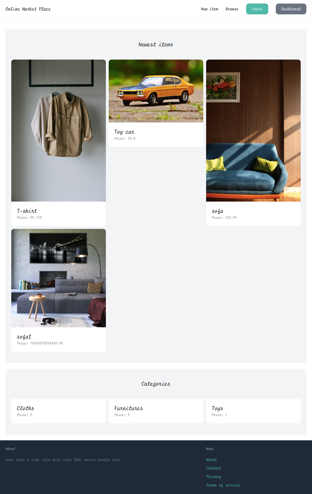
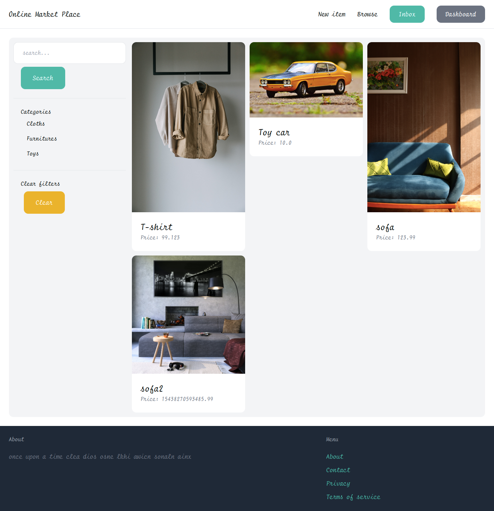
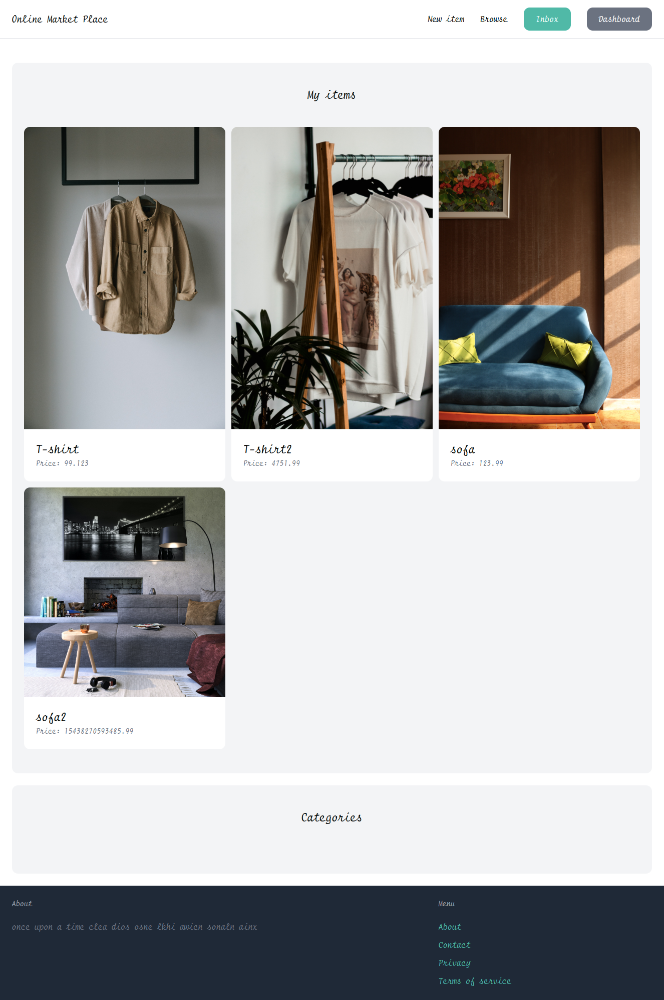
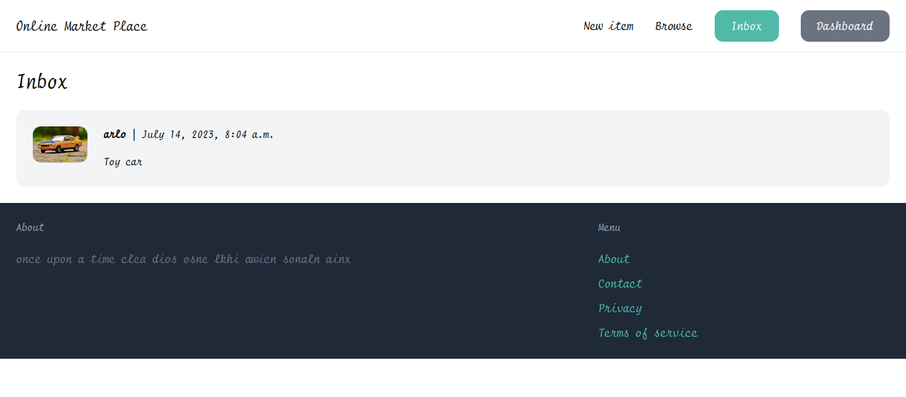
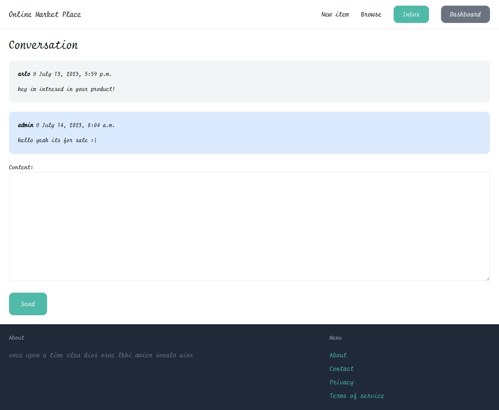

<br/>
<p align="center">
    

  <h3 align="center">E-commerce Application</h3>
</p>


## Table Of Contents

* [About the Project](#about-the-project)
* [Getting Started](#getting-started)
* [Usage](#usage)

## About The Project

# An online market built with django
<br>
<div style="display:flex;gap:5%;  justify-content: center; align-items: center; ">
    <div>
        
    </div>
    <div>
        
    </div>
    <div>
        
    </div>
</div>
<div style="display:flex;gap:5%;  justify-content: center; align-items: center; ">
    <div >
        
 </div>
    <div>
        
    </div>
</div>


## Usage

Run the following command to run the Application!

```sh
git clone https://github.com/Arl-Miz/E-commerce.git
cd E-commerce-master
python manage.py runserver
```

